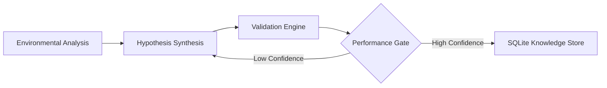

---

# StratosAI: Adaptive Autonomous Systems for Financial Signal Processing

**An engineering framework for self-evolving agents utilizing ReAct loops, Bayesian reflection, and non-stationary regime detection.**


---

## Technical Overview

StratosAI is a high-performance research platform designed to solve the problem of **model decay in non-stationary environments**. Unlike static algorithmic models, StratosAI implements a **ReAct (Reason + Act)** architectural pattern to autonomously analyze environmental shifts and recalibrate its internal logic.

### Core Engineering Workflow:

1.  **Regime Classification:** Utilizing VIX-relative percentile analysis and multi-horizon momentum vectors to classify the current environment state.
2.  **Autonomous Hypothesis Generation:** Employs a tiered fallback chain (LLM-guided $\rightarrow$ Parametric Grid Search $\rightarrow$ Stochastic search) to propose new system parameters.
3.  **Monte Carlo & Backtest Validation:** Stress-tests all proposals using bootstrapped Sharpe ratios (p5) and Calmar ratios to ensure statistical significance.
4.  **Recursive Reflection:** Evaluates performance against a dynamic threshold, triggering iterative refinement loops if stability criteria are not met.
5.  **State Persistence:** Stores successful environmental-parameter mappings to a local SQLite knowledge base for future contextual recall.

---

## System Architecture




### Module Breakdown

| Subsystem | Functionality |
| :--- | :--- |
| `src/agent/agent_graph.py` | State-machine implementation of the ReAct loop |
| `src/agent/proposal_generator.py` | Implementation of the tiered heuristic fallback logic |
| `src/agent/context_builder.py` | Multi-horizon momentum & VIX percentile feature engineering |
| `src/features/regime.py` | Probabilistic regime detection using HMM & Percentile distributions |
| `src/backtest/metrics.py` | Single source of truth for PerformanceMetrics (Sharpe, Sortino, Drawdown) |
| `src/features/lookback_guard.py` | WarmupEnforcer module to prevent temporal leakage (Look-ahead bias) |

---

## Installation & Deployment

**Requirements:** Python 3.10+, Virtual Environment.

```bash
# 1. Project Setup
git clone https://github.com/chaitanyadav69/AgentQuant-Optimizer.git
cd AgentQuant-Optimizer

# 2. Dependency Management
pip install -e .
pip install -e ".[llm]"

# 3. Environment Configuration
cp .env.example .env
# Configure keys for Gemini/OpenAI if utilizing LLM-guided synthesis

# 4. Execute Autonomous Agent
python -m src.agent.runner
```

---

## Validation & Robustness Testing

The system includes a rigorous testing suite ensuring mathematical consistency and preventing over-fitting.

```bash
pytest tests/ -v
```

**Verified Capabilities:**
* **Pydantic Schema Validation:** Strict type-checking for all configuration inputs.
* **Regime Stability:** Accuracy checks for VIX-percentile classifications.
* **Signal Integrity:** Ensuring all strategy modules produce valid ternary signals $\{-1, 0, 1\}$.
* **Bias Prevention:** Validation of `WarmupEnforcer` against data leakage in backtest cycles.

---

## Advanced Configuration

The system is controlled via `config.yaml`, allowing for granular control over the agent's "patience" and risk-aversion:

```yaml
system_logic:
  max_retry_loops: 3          # Maximum reflection iterations
  stability_threshold: 0.3    # Minimum acceptable Sharpe Ratio

processing:
  warmup_window: 252          # Enforced data window for indicator stabilization
  slippage_bps: 5.0           # Modeled market impact for realistic validation
```

---
